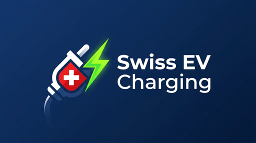

<p align="center">
  
</p>

# Swiss EV Charging (ich-tanke-strom) — Home Assistant Integration

Home Assistant integration for Switzerland's official real-time EV charging
availability, powered by the open data behind
[ich-tanke-strom.ch](https://www.ich-tanke-strom.ch), operated by the Swiss
Federal Office of Energy (SFOE). It tracks charging point availability near a GPS
position and/or for specific charging points you pin, exposes sensors and
"is free" binary sensors, and — because availability is modelled as enum sensors —
lets Home Assistant record long-term statistics for occupancy analysis.

No API key or registration is required.

## How it works

The SFOE publishes two country-wide JSON files in the OICP 2.3 format:

- **EVSEData** — static master data (location, operator, plug types, power)
- **EVSEStatus** — live availability per charging point (EVSE)

Because the data is delivered as full-country files rather than a query API, the
integration downloads the live status file **once per polling interval** and
merges it (by `EvseID`) onto locally cached master data — it does **not** poll
per station. The large master file is cached and refreshed only occasionally.

### eCarUp live-status fallback

The SFOE feed reports `Unknown` live status for a large share of **eCarUp**
charging points (`CH*ECU…`) even when eCarUp itself knows the state. eCarUp runs
its own **key-less public map API** (`www.ecarup.com/api`) that does expose the
live state, so for any tracked eCarUp station the SFOE feed leaves `unknown`, the
integration fills the gap from there.

How it works, per unresolved eCarUp station:

1. **Query** the eCarUp map for the area around the station (one request covering
   all tracked eCarUp stations), then fetch per-connector detail for the
   candidates nearby.
2. **Match** the station either by its roaming id (`Hubject.ID`, when eCarUp
   exposes it — the authoritative join) or, as a fallback, by the **nearest
   station coordinate**.
3. **Adopt** a state only when it is unambiguous: an exact `Hubject.ID` match is
   used directly; a coordinate match is used only when that station's connectors
   **unanimously agree**. An ambiguous multi-connector site stays `unknown`
   rather than showing a guess.

The eCarUp connector state maps to the availability states as:
`Free → available`, `Occupied`/`Car connected → occupied`, `Reserved →
reserved`, `Maintenance → maintenance`, `Offline → out_of_service`,
`Unknown → unknown`.

This is **best-effort** and runs only for eCarUp stations the SFOE feed could not
resolve: any failure of the eCarUp API simply leaves those stations `unknown`,
exactly as before. It fires before the "became available" notification, so an
eCarUp charger going free still notifies.

### Coverage and known gaps by operator

Most operators report reliable live status through the SFOE feed. A few do not —
they report `Unknown` (or are absent from the status feed) for many or all of
their points. The table below is a snapshot of the country-wide feed (~18,900
charging points, ~20% of which report no live status) to gauge where extra
integration effort would pay off. "Share" is the operator's fraction of all
Swiss charging points; "No live status" is how many of *its* points the SFOE feed
leaves dark.

| Operator | Share of all points | No live status | Recoverable without an API key? |
| --- | --: | --: | --- |
| **eCarUp** | ~35% | ~32% | ✅ **Yes — implemented** (public map API) |
| Move | ~13% | ~22% | ❌ Live data is app-only; no public endpoint found |
| swisscharge | ~13% | ~6% | — mostly healthy |
| Shell Recharge | ~6% | ~3% | — mostly healthy |
| AVIA VOLT | ~3% | ~14% | ❌ No public availability endpoint found |
| Tesla | ~2% | **100%** | ❌ Availability API is access-controlled (HTTP 403) |
| Power Up | ~1% | ~16% | ❌ No public endpoint found |
| Saascharge | ~1% | ~23% | ❌ No public endpoint found |
| PLUG N ROLL (Repower) | ~1% | **100%** | ❌ No reachable public endpoint |
| evpass (Green Motion) | <1% | ~95% | ❌ Map is behind authentication |
| AIL | <1% | **100%** | ❌ Not on a recoverable backend |

Operators reporting essentially complete live status (≈0% dark) include GoFast,
IONITY, Electra, Lidl, Plenitude, Chargepoint and Fastned.

**Why eCarUp was the one worth doing:** it is both the largest operator (~35% of
all Swiss points) *and* the single biggest source of missing status (~56% of all
dark points nationwide), and — uniquely among the dark operators — it exposes a
genuinely public, key-less map backend. The others either never publish live
status to the roaming/SFOE layer at all (Tesla, PLUG N ROLL, AIL) or keep it
behind their own app/authentication (Move, evpass, AVIA, Power Up, Saascharge),
so recovering them would require per-operator reverse engineering with uncertain,
fragile results.

## Installation

### HACS (recommended)

1. In HACS → Integrations → ⋮ → *Custom repositories*, add
   `https://github.com/sebastianzillessen/home-assistant-ev-charging-availability`
   as category **Integration**.
2. Install **Swiss EV Charging (ich-tanke-strom)** and restart Home Assistant.

### Manual

Copy `custom_components/swiss_ev_charging` into your Home Assistant
`config/custom_components/` directory and restart.

## Configuration

Add the integration via **Settings → Devices & Services → Add Integration →
Swiss EV Charging**. You can track stations two ways (combine both):

| Option | Description |
| --- | --- |
| Latitude / Longitude | Origin for nearby discovery (defaults to your HA home location) |
| Search radius (m) | Only stations within this radius are considered |
| Max nearby stations | Number of closest stations to expose as entities |
| Minimum power (kW) | Filter out chargers below this power |
| Plug type filter | Comma-separated substrings, e.g. `CCS` |
| Pinned EVSE IDs | Comma-separated `EvseID`s to always track (e.g. the charger near your flat) |
| Polling interval (s) | Default 180 s; minimum 60 s |
| Tag | Free-text label applied to every station of this entry (exposed as a `tag` attribute) |
| Notify when available | Toggle: send a notification when a tracked station becomes available |
| Notify service | Which `notify.*` service to call (blank = a Home Assistant persistent notification) |

At least a location **or** one pinned EVSE ID is required. Radius, filters,
pinned IDs and the interval can be changed later via the integration's
**Configure** (options) dialog.

## Entities

For each tracked charging point you get:

- **Availability sensor** (enum): `available` / `occupied` / `reserved` /
  `out_of_service` / `maintenance` / `unknown`, with attributes `operator`, `plug_types`,
  `max_power_kw`, `distance_km`, `address`, `latitude`, `longitude`, `is_pinned`.
- **"Is free" binary sensor**: on when the point is available — convenient for
  automations.

## Example automation

Notify when a pinned charger becomes free:

```yaml
automation:
  - alias: "Charger near the flat is free"
    trigger:
      - platform: state
        entity_id: binary_sensor.zurich_bahnhofstrasse_is_free
        to: "on"
    action:
      - service: notify.mobile_app
        data:
          message: "The charger near the flat is free."
```

## Development

```bash
pip install -r requirements_test.txt
pytest
```

CI runs Home Assistant's `hassfest`, HACS validation and the pytest suite on
every push and pull request.

### Upstream schema drift detection

The upstream OICP feeds occasionally change shape (e.g. a field serialised as an
object instead of an array, or a numeric value delivered as a string).
`scripts/generate_evse_schema.py` downloads both feeds and writes an inferred
JSON Schema to `schemas/`. The `Update feed schema` workflow runs weekly (and on
demand): if the regenerated schema differs from what is committed, it opens a
pull request and requests your review, so a breaking upstream change is caught
before it reaches users.

Regenerate locally with:

```bash
pip install genson
python scripts/generate_evse_schema.py
```

> The auto-PR needs "Allow GitHub Actions to create and approve pull requests"
> enabled under **Settings → Actions → General → Workflow permissions**.

### Releases

The `Release` workflow tags builds from the `version` in `manifest.json`:

- push to `main` → a GitHub release `v<version>` (created once per version bump)
- push to any other branch → a **pre-release** `v<version>-<branch>.<run>`

Bump `manifest.json` `version` to cut a new stable release on the next merge to
`main`.

## Data source

Open data from the Swiss Federal Office of Energy (SFOE) via
[data.geo.admin.ch](https://data.geo.admin.ch), dataset
`ch.bfe.ladestellen-elektromobilitaet`. See the
[SFOE documentation](https://github.com/SFOE/ichtankestrom_Documentation).

## Roadmap

Deferred for a later iteration: Home Assistant zone sourcing, live device-tracker
GPS as an origin, and dedicated automation trigger blueprints.
