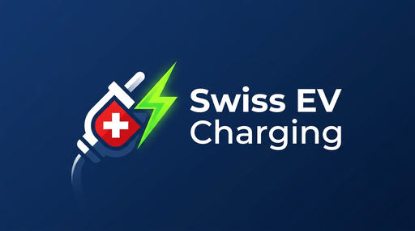

<p align="center">
  
</p>

# Swiss EV Charging (ich-tanke-strom) — Home Assistant Integration

[](https://github.com/sebastianzillessen/home-assistant-ev-charging-availability/actions/workflows/test.yml) [](https://github.com/sebastianzillessen/home-assistant-ev-charging-availability/actions/workflows/validate.yml) [](https://docs.renovatebot.com/)

Home Assistant integration for Switzerland's official real-time EV charging
availability, powered by the open data behind
[ich-tanke-strom.ch](https://www.ich-tanke-strom.ch), operated by the Swiss
Federal Office of Energy (SFOE). It tracks charging point availability near a GPS
position and/or for specific charging points you pin, exposes sensors and
"is free" binary sensors, and — because availability is modelled as enum sensors —
lets Home Assistant record long-term statistics for occupancy analysis.

No API key or registration is required.

## How it works

The SFOE publishes two country-wide JSON files in the OICP 2.3 format:

- **EVSEData** — static master data (location, operator, plug types, power)
- **EVSEStatus** — live availability per charging point (EVSE)

Because the data is delivered as full-country files rather than a query API, the
integration downloads the live status file **once per polling interval** and
merges it (by `EvseID`) onto locally cached master data — it does **not** poll
per station. The large master file is cached and refreshed only occasionally.

### Operator live-status fallbacks

The SFOE feed reports `Unknown` live status for a large share of some operators'
charging points even when the operator itself knows the state. For those
operators that expose their own **key-less public API**, the integration fills
the gap: for any tracked station the SFOE feed leaves `unknown`, it looks the
state up from the operator's own backend. Two operators are covered today —
**eCarUp** and **Move** — together the two biggest sources of missing status.

All of this is **best-effort** and runs only for stations the SFOE feed could not
resolve: any failure of an operator API simply leaves those stations `unknown`,
exactly as before. It fires before the "became available" notification, so a
charger going free still notifies. Diagnostics list what each fallback filled
(`ecarup_resolved_ids`, `move_resolved_ids`).

**eCarUp** (`CH*ECU…`) — via eCarUp's public map API (`www.ecarup.com/api`). Per
station: query the map for the area (one request covering all tracked eCarUp
stations), fetch per-connector detail, then match either by roaming id
(`Hubject.ID`, the authoritative join) or by nearest-station coordinate — the
coordinate match is used only when that station's connectors **unanimously
agree**, so an ambiguous multi-connector site stays `unknown` rather than
guessing. Connector state maps as `Free → available`,
`Occupied`/`Car connected → occupied`, `Reserved → reserved`,
`Maintenance → maintenance`, `Offline → out_of_service`, `Unknown → unknown`.

**Move & roaming networks** — via the Move app's public search endpoint
(`app.move.ch/search`). One request covers all tracked stations. The join is
**direct and authoritative**: each returned station's id *is* the OICP `EvseID`,
so no coordinate matching is needed. Availability maps as `available → available`,
`occupied → occupied`, `outOfService → out_of_service`, `unknown → unknown`. The
endpoint returns the roaming networks near the queried point, not just Move's own
stations, so it also fills live status the SFOE feed leaves `unknown` for
**Repower / PLUG N ROLL** (`CH*REP…`), **AVIA VOLT** (`CH*AVI…`) and **Power Up**
(`CH*POW…`) in addition to Move itself (`CH*CCI…`, `CH*CCC…`). (Move's
`CH*SOC`/`CH*MMN` points are not served by this backend and are not recovered.)

### Coverage and known gaps by operator

Most operators report reliable live status through the SFOE feed. A few do not —
they report `Unknown` (or are absent from the status feed) for many or all of
their points. The table below is a snapshot of the country-wide feed (~18,900
charging points, ~20% of which report no live status) to gauge where extra
integration effort would pay off. "Share" is the operator's fraction of all
Swiss charging points; "No live status" is how many of *its* points the SFOE feed
leaves dark.

| Operator | Share of all points | No live status | Recoverable without an API key? |
| --- | --: | --: | --- |
| **eCarUp** | ~35% | ~32% | ✅ **Yes — implemented** (public map API) |
| **Move** | ~13% | ~22% | ✅ **Yes — implemented** (public app search API) |
| swisscharge | ~13% | ~6% | — mostly healthy (own app API unverified) |
| Shell Recharge | ~6% | ~3% | — mostly healthy |
| **AVIA VOLT** | ~3% | ~14% | ✅ **Yes — implemented** (via the Move search endpoint) |
| Tesla | ~2% | **100%** | ❌ Availability API is access-controlled (HTTP 403) |
| **Power Up** | ~1% | ~16% | ✅ **Yes — implemented** (via the Move search endpoint) |
| Saascharge | ~1% | ~23% | ❌ No public endpoint found |
| **PLUG N ROLL (Repower)** | ~1% | **100%** | ✅ **Yes — implemented** (via the Move search endpoint) |
| evpass (Green Motion) | <1% | ~95% | ⚠️ Maybe (Shell Recharge map API; not yet verified) |
| AIL | <1% | **100%** | ❌ Not on a recoverable backend |

Operators reporting essentially complete live status (≈0% dark) include GoFast,
IONITY, Electra, Lidl, Plenitude, Chargepoint and Fastned.

**The two key-less backends cover most of the gap.** eCarUp's map API recovers
eCarUp, and the Move search endpoint recovers Move plus the Repower / AVIA VOLT /
Power Up roaming networks. The operators still dark either don't publish live
status to the roaming/SFOE layer at all (Tesla, AIL) or keep it behind their own
authentication (Saascharge, and — pending verification — swisscharge and evpass),
so recovering them would need per-operator reverse engineering with uncertain,
fragile results.

## Installation

### HACS (recommended)

1. In HACS → Integrations → ⋮ → *Custom repositories*, add
   `https://github.com/sebastianzillessen/home-assistant-ev-charging-availability`
   as category **Integration**.
2. Install **Swiss EV Charging (ich-tanke-strom)** and restart Home Assistant.

### Manual

Copy `custom_components/swiss_ev_charging` into your Home Assistant
`config/custom_components/` directory and restart.

## Configuration

Add the integration via **Settings → Devices & Services → Add Integration →
Swiss EV Charging**. You can track stations two ways (combine both):

| Option | Description |
| --- | --- |
| Latitude / Longitude | Origin for nearby discovery (defaults to your HA home location) |
| Display radius (m) | Which stations are tracked and shown on the map (default 2 km) |
| Alert radius (m) | Only stations within this radius may fire the "became available" alert. `0` = same as the display radius (options dialog only) |
| Max nearby stations | Number of closest stations to expose as entities |
| Minimum power (kW) | Filter out chargers below this power |
| Plug type filter | Comma-separated substrings, e.g. `CCS` |
| Pinned EVSE IDs | Comma-separated `EvseID`s to always track (e.g. the charger near your flat) |
| Polling interval (s) | Default 180 s; minimum 60 s |
| Tag | Free-text label applied to every station of this entry (exposed as a `tag` attribute) |
| Notify when available | Toggle: send a notification when a station becomes available (subject to the alert scope below) |
| Notify service | Which `notify.*` service to call (blank = a Home Assistant persistent notification) |
| Map marker style | Colour map markers by availability — off / coloured dot / glyph per state / plug + status pip (see [Showing the chargers on the map](#showing-the-chargers-on-the-map)) |
| Append power to name | Suffix each station name with its rated power (e.g. `· 224 kW`), so it shows on the map marker label |

At least a location **or** one pinned EVSE ID is required. Radius, filters,
pinned IDs and the interval can be changed later via the integration's
**Configure** (options) dialog.

**Display vs. alert radius.** The **display radius** (larger, default 2 km) decides
which stations are queried and shown on the map; the **alert radius** (smaller) is
the tighter zone that actually triggers a "became available" notification — so you
can watch a wide area on the map but only be pinged about chargers close to you.
Leave the alert radius at `0` to alert for everything shown.

**Alert scope.** As soon as you **pin** any station, alerts switch to
**pinned-only** — the alert radius is ignored and you are notified only about your
pinned chargers. With no pins, every station within the alert radius alerts.
(Existing setups created before this split keep their old single radius for both,
so nothing changes until you set the new values.)

## Entities

For each tracked charging point you get:

- **Availability sensor** (enum): `available` / `occupied` / `reserved` /
  `out_of_service` / `maintenance` / `unknown`, with attributes `operator`, `plug_types`,
  `max_power_kw`, `power_type`, `distance_km`, `address`, `latitude`, `longitude`, `is_pinned`.
- **Power sensor** (kW): the charging point's rated maximum power — a first-class
  value for dashboards and the details page, not just an attribute.
- **Connector sensor**: the plug type and current type, e.g. `CCS Combo 2 · DC`
  or `Type 2 · AC 3-phase`.
- **"Is free" binary sensor**: on when the point is available — convenient for
  automations.

## Showing the chargers on the map

Because the availability sensor carries `latitude`/`longitude` attributes, each
tracked charger already appears on Home Assistant's built-in **Map** panel and
can be added to a dashboard map card. (If your `type: map` card shows nothing,
set `show_all: true` or list the sensors under `entities:`.)

```yaml
type: map
show_all: true
label_mode: state   # marker label shows available / occupied / …
```

Home Assistant colours map markers statically, not by state. To get
**availability-coloured markers** (green when free, red when in use), set the
**"Map marker style"** option (integration → *Configure*). Each availability
sensor then exposes a state-coloured badge as its `entity_picture`, so markers
follow availability automatically — no template sensors needed. Styles:

| Style | Marker |
| --- | --- |
| **Off** (default) | keeps the normal `mdi:ev-station` icon |
| **Coloured dot** | a plain disc, coloured by state |
| **Glyph per state** | one white glyph per state — plug (free), bolt (in use), hourglass (reserved), wrench (maintenance), power (out of service), ? (unknown) |
| **Plug + status pip** | a plug on every marker with a small corner pip carrying the state glyph |

The glyph and pip styles encode the state as a **shape**, not just a colour, so
they stay legible in greyscale and for red-green colour vision deficiency.
Colours: green = available, red = occupied, orange = reserved,
purple = maintenance, grey = out of service, light grey = unknown.

**Charging speed** is shown by a neutral outer ring on any coloured style — no
ring for standard chargers (< 50 kW), one ring for fast DC (50–149 kW) and two
for ultra/HPC (≥ 150 kW) — so fast chargers stand out on the map at a glance
without a separate filter.

To also put the **power in the marker label**, enable **"Append the rated power
to each station name"** (integration → *Configure*). Station names then read e.g.
`MOVE La Côte · 224 kW`, which shows on the marker popup. (It changes the friendly
name everywhere, not just the map, so it is off by default.) If your Home
Assistant `map` card supports an attribute label, you can instead label markers by
the `max_power_kw` attribute with no rename.

Note the trade-off: because a marker's image is the entity's `entity_picture`,
which Home Assistant also uses everywhere else, any style other than *Off*
replaces the sensor's icon in entity lists, cards and the more-info dialog too —
not only on the map. It is therefore *Off* by default.

If you would rather keep the icon and colour only the map, drive the map from a
small template sensor that mirrors the charger and sets the `entity_picture`
itself, and add that sensor to the map instead:

```yaml
template:
  - sensor:
      - name: Charger XY (map)
        state: "{{ states('sensor.charger_xy_availability') }}"
        attributes:
          latitude: "{{ state_attr('sensor.charger_xy_availability', 'latitude') }}"
          longitude: "{{ state_attr('sensor.charger_xy_availability', 'longitude') }}"
          entity_picture: >
            
            
            data:image/svg+xml,<svg xmlns='http://www.w3.org/2000/svg' width='24'
            height='24'><circle cx='12' cy='12' r='11' fill='{{ c }}'/></svg>
```

For richer per-marker styling, the community `nathan-gs/ha-map-card` custom card
is another alternative.

## Example automation

Notify when a pinned charger becomes free:

```yaml
automation:
  - alias: "Charger near the flat is free"
    trigger:
      - platform: state
        entity_id: binary_sensor.zurich_bahnhofstrasse_is_free
        to: "on"
    action:
      - service: notify.mobile_app
        data:
          message: "The charger near the flat is free."
```

## Development

```bash
pip install -r requirements_test.txt
pytest
```

CI runs Home Assistant's `hassfest`, HACS validation and the pytest suite on
every push and pull request.

### Upstream schema drift detection

The upstream OICP feeds occasionally change shape (e.g. a field serialised as an
object instead of an array, or a numeric value delivered as a string).
`scripts/generate_evse_schema.py` downloads both feeds and writes an inferred
JSON Schema to `schemas/`. The `Update feed schema` workflow runs weekly (and on
demand): if the regenerated schema differs from what is committed, it opens a
pull request and requests your review, so a breaking upstream change is caught
before it reaches users.

Regenerate locally with:

```bash
pip install genson
python scripts/generate_evse_schema.py
```

> The auto-PR needs "Allow GitHub Actions to create and approve pull requests"
> enabled under **Settings → Actions → General → Workflow permissions**.

### Releases

The `Release` workflow tags builds from the `version` in `manifest.json`:

- push to `main` → a GitHub release `v<version>` (created once per version bump)
- push to any other branch → a **pre-release** `v<version>-<branch>.<run>`

Bump `manifest.json` `version` to cut a new stable release on the next merge to
`main`.

## Data source

Open data from the Swiss Federal Office of Energy (SFOE) via
[data.geo.admin.ch](https://data.geo.admin.ch), dataset
`ch.bfe.ladestellen-elektromobilitaet`. See the
[SFOE documentation](https://github.com/SFOE/ichtankestrom_Documentation).

## Roadmap

Deferred for a later iteration: Home Assistant zone sourcing, live device-tracker
GPS as an origin, and dedicated automation trigger blueprints.
